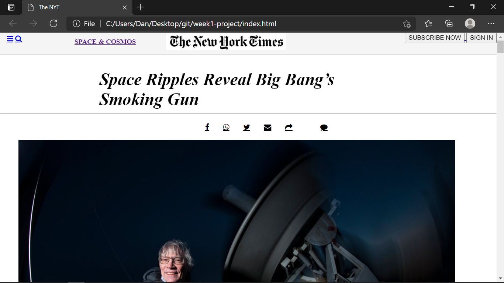

README.md                    

The requirements of this project consists of making a clone of a New York Times article page. Applying some concepts of:

- Embedding images
- Floats and positioning
- The box model

New York Times article page

Additional description about the project and its features.

Built With  Html Css Technologies

👤 Author1

- GitHub:[@danmainah](https://github.com/danmainah)
- Twitter: [@dan_mainah](https://twitter.com/dan_mainah)
- Linkedin:[@danielmaina](www.linkedin.com/in/daniel-maina-315a38191)
 

## Live Link
Here is the live link
[link](https://danmainah.github.io/week1-project/)

